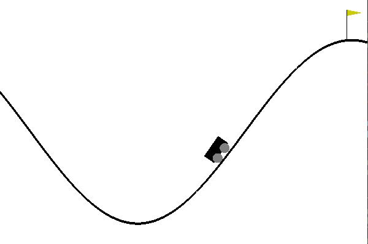
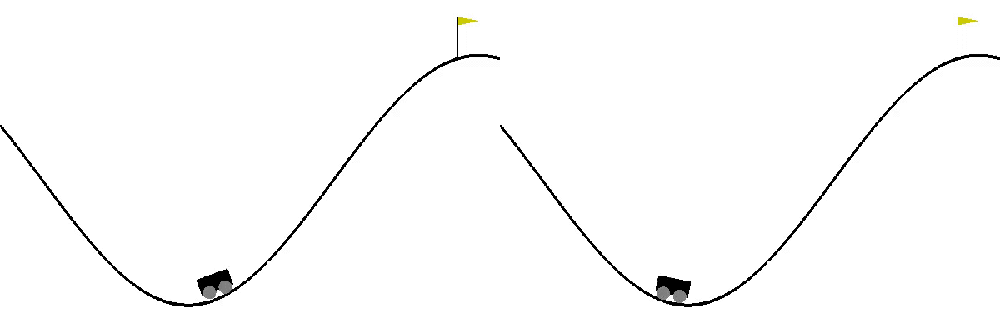
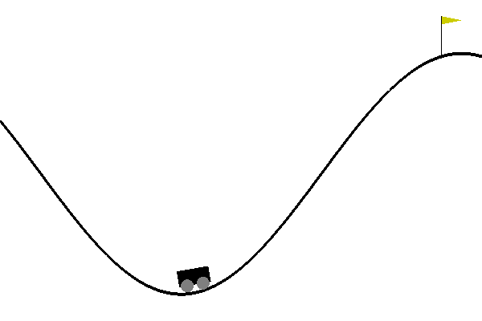

====================================
APReL: A Library for Active Preference-based Reward Learning Algorithms
====================================

.. image:: https://readthedocs.org/projects/aprel/badge/?version=latest
  :target: http://aprel.readthedocs.io/en/latest/?badge=latest
  :alt: Documentation Status

+---------------------------------------------+------------------------------------------------------------+-----------------------------------------+----------------------------------------------------------------------------+------------------------------------------------------------------+----------------------------------------+
| `Paper <https://arxiv.org/abs/2108.07259>`_ | `Documentations <https://aprel.readthedocs.io/en/latest>`_ | `Video <https://youtu.be/HvwlBNy3l40>`_ | `Installation <https://aprel.readthedocs.io/en/latest/installation.html>`_ | `Example <https://aprel.readthedocs.io/en/latest/example.html>`_ | `Talk <https://youtu.be/HExrlibCxdI>`_ |
+---------------------------------------------+------------------------------------------------------------+-----------------------------------------+----------------------------------------------------------------------------+------------------------------------------------------------------+----------------------------------------+

**APReL** is a unified Python3 library for active preference-based reward learning methods. It offers a modular framework for experimenting with and implementing preference-based reward learning techniques; which include active querying, multimodal learning, and batch generation methods.
   

Installation
########

**APReL** runs on Python 3.

Installation
**********************

1. **APReL** uses `ffmpeg <https://www.ffmpeg.org/>`_ for trajectory visualizations. Install it with the following command on Linux:

.. code-block:: sh

   apt install ffmpeg

If you are using a Mac, you can use `Homebrew <https://brew.sh/>`_ to install it:

.. code-block:: sh

   brew install ffmpeg

2. Clone the aprel repository

.. code-block:: sh

   git clone https://github.com/Stanford-ILIAD/APReL.git
   cd APReL

3. Install the base requirements with

.. code-block:: sh

   pip3 install -r requirements.txt

4. (Optional) If you want to build the docs locally, you will also need some additional packages, which can be installed with:

.. code-block:: sh

   pip3 install -r docs/requirements.txt

5. Install **APReL** from the source by running:

.. code-block:: sh

   pip3 install -e .

6. Test **APReL**'s runner file by running

.. code-block:: sh

   python examples/simple.py

You should be able to see the `MountainCarContinuous-v0 <https://gym.openai.com/envs/MountainCarContinuous-v0/>`_ environment rendering multiple times.
After it renders (and saves) 10 trajectories, it is going to query you for your preferences. See the next section for more information about this runner file.

Example
########

Let's now go over a simple example of how to use **APReL**. This example is based on the `examples/simple.py <examples/simple.py>`_ file.

We first import **APReL** and the other necessary libraries. `Gym library <https://gym.openai.com>`_ is needed for inputting an environment.

.. code-block:: python

    import aprel
    import numpy as np
    import gym

In this example, we will be using the `MountainCarContinuous-v0 <https://gym.openai.com/envs/MountainCarContinuous-v0/>`_ environment. Let's create an environment object and set the random seeds for reproducibility:

.. code-block:: python

    env_name = 'MountainCarContinuous-v0'
    gym_env = gym.make(env_name)
    np.random.seed(0)
    gym_env.seed(0)

The original goal in `MountainCarContinuous-v0 <https://gym.openai.com/envs/MountainCarContinuous-v0/>`_ is to move the car such that it reaches the yellow flag.

In preference-based reward learning, a *trajectory features function* must accompany the environment.
In **APReL**, this is handled with a user-provided function which takes a list of state-action pairs (of a trajectory) and outputs the array of features.
For the `MountainCarContinuous-v0 <https://gym.openai.com/envs/MountainCarContinuous-v0/>`_ where states consist of position and velocity values, let's use the minimum position, maximum position and the average speed as our features.
**Note**: As in `Biyik et al. (2019) <https://arxiv.org/abs/1910.04365>`_, our feature function below normalizes the features by subtracting the mean and dividing by the standard deviation. These mean and standard deviation values come from randomly generated trajectories, which we pre-computed offline. While this is not a necessary step, it may sometimes make the learning faster.

.. code-block:: python

    def feature_func(traj):
        """Returns the features of the given MountainCar trajectory, i.e. \Phi(traj).
        
        Args:
            traj: List of state-action tuples, e.g. [(state0, action0), (state1, action1), ...]
        
        Returns:
            features: a numpy vector corresponding the features of the trajectory
        """
        states = np.array([pair[0] for pair in traj])
        actions = np.array([pair[1] for pair in traj[:-1]])
        min_pos, max_pos = states[:,0].min(), states[:,0].max()
        mean_speed = np.abs(states[:,1]).mean()
        mean_vec = [-0.703, -0.344, 0.007]
        std_vec = [0.075, 0.074, 0.003]
        return (np.array([min_pos, max_pos, mean_speed]) - mean_vec) / std_vec

We are now ready to wrap the environment into an **APReL** environment along with the feature function:

.. code-block:: python

    env = aprel.Environment(gym_env, feature_func)

**APReL** comes with a query optimizer that works over a predefined set of trajectories. For this, let's create a trajectory set that consists of 10 randomly generated trajectories:

.. code-block:: python

    trajectory_set = aprel.generate_trajectories_randomly(env, num_trajectories=10,
                                                          max_episode_length=300,
                                                          file_name=env_name, seed=0)
    features_dim = len(trajectory_set[0].features)

Let's now define the optimizer which will optimize the queries by considering trajectories from the trajectory set we have just created:

.. code-block:: python

    query_optimizer = aprel.QueryOptimizerDiscreteTrajectorySet(trajectory_set)

**APReL** allows both simulated and real humans. In this example, we will assume a real human is going to respond to the queries. Next, we define this such that there will be a 0.5 seconds delay time after each trajectory visualization during querying.

.. code-block:: python

    true_user = aprel.HumanUser(delay=0.5)

We will learn a reward function that is linear in trajectory features by assuming a softmax human response model.
Let's initiate this model with a random vector of weights.
Here, we are using a random vector for weights, because we will already be learning them. So the values we pass here are not important.
But we still need to pass them so that the model knows the feature dimensionality. If we wanted to set the other parameters of the softmax model, e.g., rationality coefficient, we would also do that here.

.. code-block:: python

    params = {'weights': aprel.util_funs.get_random_normalized_vector(features_dim)}
    user_model = aprel.SoftmaxUser(params)
    

After defining our user model, we now create a belief distribution over the parameters we want to learn. We will be learning only the *weights*, so let's use the same dictionary of parameters.
If we wanted to learn the other parameters of the softmax model, we would pass them here.

.. code-block:: python

    belief = aprel.SamplingBasedBelief(user_model, [], params)
    print('Estimated user parameters: ' + str(belief.mean))
    
    
Running the above code should print an estimate for the weights. Since we have not provided any data yet, this estimate is not meaningful.
We need to query the user to elicit their preferences.
For this, we will first initialize a dummy query. The query optimizer will then optimize a query of the same kind.
For example, let's create a dummy preference query (*do you prefer trajectory A or B?* kind of query) with the first two trajectories in the trajectory set:

.. code-block:: python

    query = aprel.PreferenceQuery(trajectory_set[:2])
    
   
Now, every time we call the query optimizer with this query, it is going to give us an optimized *preference query*. If we created a, say, weak comparison query, then the optimized queries would also be weak comparison queries.
In the next for-loop, we repeatedly do three things: (i) optimize a query, (ii) ask the user for a response to the optimized query, (iii) update the belief distribution with the response.

.. code-block:: python

    for query_no in range(10):
        queries, objective_values = query_optimizer.optimize('mutual_information', belief, query)
        # queries and objective_values are lists even when we do not request a batch of queries.
        print('Objective Value: ' + str(objective_values[0]))
        
        responses = true_user.respond(queries[0])
        belief.update(aprel.Preference(queries[0], responses[0]))
        print('Estimated user parameters: ' + str(belief.mean))

Running this code will ask you to respond 10 preference queries that are optimized with respect to the mutual information acquisition function.
Below is the first query that is asked to the user:

We select 0 for this query. In other words, we say we prefer the first trajectory. Because it gets closer to solving the task by moving closer to the yellow flag, even though it cannot make it.
Continuing in this fashion, we responded the following 9 queries with: [0, 0, 0, 1, 0, 1, 0, 0, 0]. At the end, we see this output:

.. code-block:: sh

    Estimated user parameters: {'weights': array([-0.28493522,  0.72942661,  0.62189126])}

Remember our features function: minimum position, maximum position and average speed. The second coefficient being ~0.73 means that we want the maximum position to be high.
And it is indeed the case, because we tried to make the car go as further as possible. But how about the other two features?
Well, in this case, all features were correlated: In this environment, you have to go back to move further, so we indeed want the minimum position to be low. Similarly, to go further, we need high speeds.
Although this is not a part of **APReL**, we trained a reinforcement learning agent using `Soft-Actor Critic <https://github.com/jparkerholder/SAC-PyTorch>`_ with this learned reward function (we used `this implementation <https://github.com/jparkerholder/SAC-PyTorch>`_). This is what we got:

  
Only after 10 queries, we were able to learn a reward function that solves the game! Note that the agent also makes sure to go as back as possible because of the way we designed the features.

Interested in learning other options and features of **APReL**? Take a look at a more advanced example at: `examples/advanced.py <examples/advanced.py>`_!
